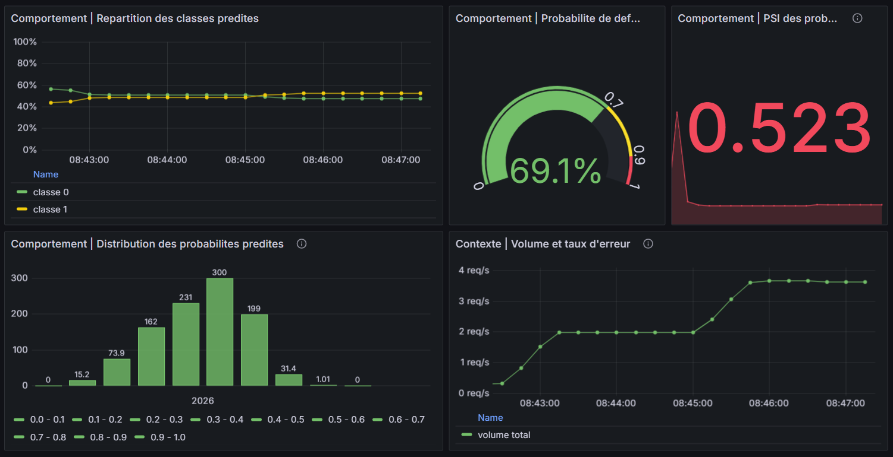

# M6-B1 — Analyse de dérive et performance du modèle Pyrenex

Ce projet analyse trois mois de production du modèle de risque déployé en M5.
L'objectif est de distinguer un **data drift** d'un **concept drift**, d'évaluer
la calibration des probabilités et de proposer une action proportionnée.

## 🚀 Démarrage

```bash
python -m venv .venv && source .venv/bin/activate
pip install -r requirements.txt
pytest -q tests            # vert dès le clone (certains tests se débloquent avec vos TODO)
jupyter notebook notebooks/M6-B1_template_celia_theo.ipynb
```

> Variante `uv` : `uv venv .venv && source .venv/bin/activate` puis
> `uv pip install -r requirements.txt`.
> Dépannage : `No module named pip` → vous êtes dans un venv créé par `uv`,
> utilisez `uv pip install …` (pas `pip install`).

Les **données sont fournies** dans `data/` : `reference_set.csv` (baseline),
`prod_3months.csv` (3 mois de production), `predictions_log.csv` (logs du modèle).

## 🔎 Travaux réalisés

| Analyse | Résultat | Fichier |
|---|---|---|
| Exploration des distributions | Comparaison référence / production, histogrammes à bornes communes et taux de valeurs manquantes | [notebooks/M6-B1_template_celia_theo.ipynb](notebooks/M6-B1_template_celia_theo.ipynb) |
| Détection statistique | PSI, KS et Chi² sur les variables numériques et catégorielles | [src/drift_detection.py](src/drift_detection.py) |
| Sensibilité du PSI | Pour `annual_inc`, PSI entre deux moitiés aléatoires de `reference_set`, sur 200 découpages | [notebooks/M6-B1_template_celia_theo.ipynb](notebooks/M6-B1_template_celia_theo.ipynb) |
| Calibration | Reliability diagram et ECE sur les semaines 1-4 et 9-12 | [src/calibration.py](src/calibration.py) |
| Performance temporelle | AUC calculée sur les mêmes fenêtres de production | [notebooks/M6-B1_template_celia_theo.ipynb](notebooks/M6-B1_template_celia_theo.ipynb) |
| Recommandation | Diagnostic et recommandation via `recommendations.py` | [notebooks/M6-B1_template_celia_theo.ipynb](notebooks/M6-B1_template_celia_theo.ipynb) |
| Dashboard live | Extension du dashboard Grafana de la stack M5 | [grafana/provisioning/dashboards/pyrenex_prod.json](grafana/provisioning/dashboards/pyrenex_prod.json) |

## 📊 Résultats

### Dérive des variables

- `int_rate` : PSI `0,4429`, KS p-value environ `4,6e-65` ; dérive forte.
- `revol_util` : PSI `0,1864`, KS p-value environ `3,8e-20` ; signal à investiguer.
- `grade` : Chi² p-value environ `3,65e-07` ; déplacement vers des grades plus risqués.
- `annual_inc` : PSI référence / production `0,0666` ; amplitude sous le repère
  conventionnel de `0,10`, mais supérieure à la variabilité interne observée
  dans la référence.

Pour vérifier que ce résultat sur `annual_inc` n'est pas dû à une référence
hétérogène, 200 découpages aléatoires de `reference_set` en deux moitiés ont
été réalisés. Le PSI entre les deux moitiés est en moyenne de `0,0241`, avec
un intervalle empirique à 95 % de `[0,0082 ; 0,0521]`. Aucun des 200 PSI ne
dépasse `0,10`. Le PSI référence / production de `0,0666` est donc supérieur
à la borne haute de cette variabilité interne (`0,0521`) : il constitue un
signal de dérive pour `annual_inc`, même s'il reste sous le seuil conventionnel
de `0,10`.

Le seuil `0,10` est un repère pratique et arbitraire, pas une preuve d'absence
de dérive. Dans ce cas, la comparaison avec la distribution de référence et
avec la variabilité obtenue par les 200 découpages montre une dérive de faible
amplitude mais réelle, qui doit être surveillée.

### Performance et calibration

- AUC semaines 1-4 : `0,7419` ; AUC semaines 9-12 : `0,7459`.
- ECE semaines 1-4 : `0,2403` ; ECE semaines 9-12 : `0,3152`.
- La capacité de classement reste stable, mais les probabilités sont de plus
  en plus sur-confiantes : la probabilité moyenne prédite passe d'environ
  `0,4427` à `0,5158`, alors que le taux réel de défaut reste proche de `0,20`.

Le diagnostic retenu est donc un **data drift avéré**, avec un **concept drift
non avéré**. La recommandation est de contrôler la qualité des données,
surveiller la calibration et recalibrer sur des données récentes avant
d'envisager un réentraînement complet.

## 📈 Dashboard Grafana

Le dashboard est provisionné dans le dossier attendu par la stack M5 et ajoute
quatre vues opérationnelles au suivi de production :

1. médiane et p90 des probabilités prédites, à partir des buckets de
   `pyrenex_prediction_proba` avec `rate()` et `histogram_quantile()` ;
2. répartition des classes prédites via `pyrenex_predictions_total` ;
3. volume des requêtes et taux d'erreur HTTP via `http_requests_total` ;
4. PSI live des probabilités prédites via la gauge `pyrenex_prediction_psi`.



Le trafic de démonstration a été généré avec
[src/generate_traffic.py](src/generate_traffic.py), utilisé sur la stack M5 :

```bash
python src/generate_traffic.py --requests 500 --concurrency 20 --seed 42
```

Le script envoie des requêtes valides à `http://localhost:8001/score` et varie
les caractéristiques des dossiers. Les métriques sont ensuite exposées par
les services M5, scrapées par Prometheus et visualisées dans Grafana.

### Comment le PSI est mesuré dans Grafana

La stack M5 expose bien un PSI live dans Prometheus sous la métrique
`pyrenex_prediction_psi`, affichée dans le panel « Comportement | PSI des
probabilités prédites ». Le calcul est effectué par le service `model`, puis
Grafana interroge directement la gauge avec la requête PromQL
`pyrenex_prediction_psi`.

Ce PSI live ne mesure pas les mêmes distributions que le PSI du notebook. Dans
Grafana, il compare progressivement la distribution des **probabilités de
défaut prédites en production** à une distribution de référence gelée du
modèle, chargée depuis la baseline M5. Les probabilités sont réparties dans les
bins `[0, 0.1, ..., 1.0]`. À chaque prédiction, le compteur de la tranche est
mis à jour, puis la proportion observée est comparée à la proportion attendue
de la baseline :

$$
PSI = \sum_i (p_{production,i} - p_{reference,i})
\ln\left(\frac{p_{production,i}}{p_{reference,i}}\right)
$$

Le calcul utilise un petit epsilon pour éviter les divisions ou logarithmes de
zéro. La gauge est initialisée à zéro, puis évolue à mesure que le trafic arrive.
Le dashboard applique les repères visuels suivants : vert sous `0,10`, orange
entre `0,10` et `0,25`, rouge au-dessus de `0,25`.

### Réserve sur la valeur PSI affichée

La valeur visible dans la capture Grafana est d'environ `0,523`, donc nettement
au-dessus du seuil rouge de `0,25`. Ce niveau paraît étonnant et ne doit pas
être interprété seul comme la preuve d'une dérive du modèle. Dans la stack M5,
le PSI est calculé de manière **cumulative depuis le démarrage du service** :
les compteurs des bins sont alimentés par les prédictions reçues et la gauge
est recalculée après chaque nouvelle prédiction. Ce n'est donc pas un PSI sur
une fenêtre glissante fixe.

La valeur dépend fortement de la baseline gelée du modèle, des bins
`[0, 0.1, ..., 1.0]`, du nombre de prédictions reçues, du moment où la capture
est prise et de la représentativité du trafic envoyé. Le script
`generate_traffic.py` produit un trafic de démonstration aléatoire ; sa
distribution peut être différente de la population de production utilisée pour
construire la baseline. Un PSI élevé peut donc refléter un décalage entre la
baseline et ce trafic de test, ou un effet du faible volume au début du service,
plutôt qu'une dérive métier confirmée.

La bonne lecture consiste à vérifier la tendance après un volume suffisant de
prédictions, à comparer la distribution des probabilités aux bins de la
baseline, et à compléter avec les métriques du notebook : PSI des features,
KS, Chi², AUC et calibration. Les seuils `0,10` et `0,25` restent des repères
pratiques ; ils ne remplacent pas cette vérification.

Le PSI des features, le KS, le Chi² et l'AUC sur 12 semaines restent des
mesures batch documentées dans le notebook. Le PSI des probabilités, lui, est
suivi en continu dans Grafana grâce à `pyrenex_prediction_psi`, en complément
du trafic, des erreurs, de la distribution des probabilités et des classes
prédites.

## 📚 Ressources

Voir [`./ressources/`](./ressources/) — 5 mini-cours + `liens_officiels.md`.
